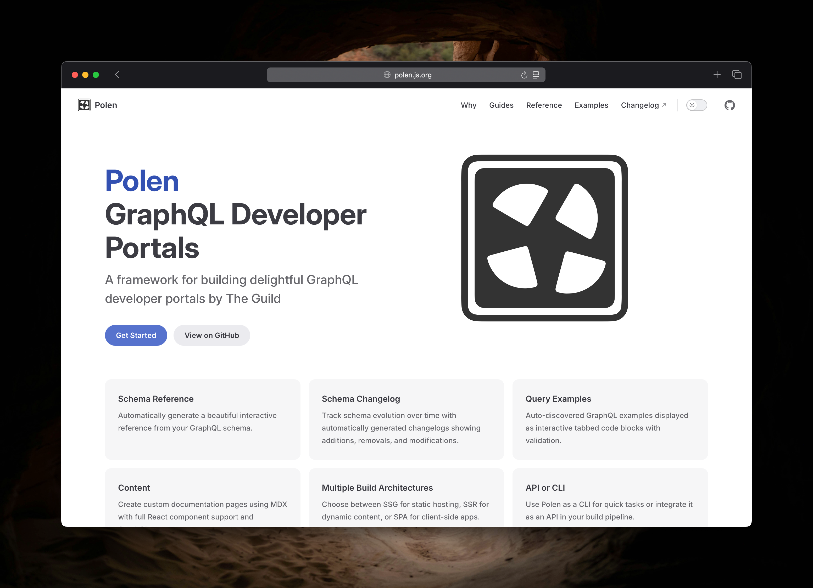

# DISCOVERING GRAFFLE

<br>

## And Some of its TypeScript Techniques

<span style="font-size: 0.6rem;color:hsla(45, 50%, 80%, 1);">
  <!-- Animal Emojis Edition -->
  <div class="ml-1 inline-flex flex-row gap-2">
    <fxemoji-goat />
    <fxemoji-wolfface />
    <fxemoji-octopus />
    <fxemoji-dragonside />
    <fxemoji-honeybee />
    <fxemoji-spurtingwhale />
  </div>
</span>


---
layout: statement
---

# Plan

45 minutes

<div style="text-align: left;">

## `Part 1` Discovering Graffle

## `Part 2` TypeScript Techniques

</div>


---
layout: statement
---

# `Part 1` <br> Discovering Graffle


---

# What is it?

- A TypeScript library for sending GraphQL requests
- `npm add graffle@next`
- Inspirations include Genql and Prisma
- What makes it special:
  - Document builder supporting all of GraphQL
  - Focus on type safety
  - Modular (e.g. transports)




---
layout: statement
---

# Demo Time

<br>

<a class="emoji-link" href="cursor://file//Users/jasonkuhrt/projects/graffle/tech-talk-2024-11/demos/1-gql.ts"><fxemoji-goat /></a>

---
layout: image
title: Components Overview
---

<style>
#slide-container:has(.slidev-page-6:not([style*="display: none"])) {
  background: black!important;
}
#slideshow:has(.slidev-page-6:not([style*="display: none"])) {
	background: black!important;

  .slidev-layout {
    padding: 0!important;
    margin: 0!important;
  }
}

</style>


---
layout: two-cols-header
---

# Is it <strike>done</strike> production ready?

- No (but maybe good enough for you?)
- Continuous pre-releases: `pnpm add graffle@next`
- 500+ tests: unit (type & value level) + E2E
- Bug fixes prioritized (closed in single digit days)

::left::

## Stable (ish)

- Raw interface
- Document builder interface
- Request pipeline
- Custom Scalars


::right::

## Unstable (ish)

- Extension System
- Extensions
- Output configuration
- CLI


---

<style>
.local .slidev-code {
  font-size: 1.8rem;
}
</style>
<div class="local">

# What's Next?

### Sustainability

- Handful of one-time donations (Open Collective)
- Sponsorship by The Guild
- Decreased hours starting December: 15-20 hours/wk

### Features Etc.

```
Currently:
* feat(extension-system) : Extensible transports
* improve(perf)          : Reduce bundle size (e.g. web preset, http transport, no memory)

Soon:
* chore(docs)            : Better documentation (Website, JSDoc)
* refactor               : Extract anyware package
* feat(request)          : OneOf, @defer, @stream, subscription
* improve(types)         : Simplify _appearance of_ public interface types
* feat(extension/*)      : More: Effect, Cache, BatchRequest ...
* feat                   : Automated Clients: @graffle/client-github | shopify | cloudflare-queues | yelp
* feat(extension-system) : Extensible directives
```

</div>

---
layout: statement
---

# `Part 2` <br> TypeScript Techniques

<div class="inline-flex flex-row gap-4">
  <a class="emoji-link" href="cursor://file//Users/jasonkuhrt/projects/graffle/tech-talk-2024-11/techniques/1-global-augmentation/main.ts"><fxemoji-wolfface /></a>
  <a class="emoji-link" href="cursor://file//Users/jasonkuhrt/projects/graffle/tech-talk-2024-11/techniques/2-type-level-functions/main.ts"><fxemoji-octopus /></a>
  <a class="emoji-link" href="cursor://file//Users/jasonkuhrt/projects/graffle/tech-talk-2024-11/techniques/3-recursive-builder/main.ts"><fxemoji-dragonside /></a>
  <a class="emoji-link" href="cursor://file//Users/jasonkuhrt/projects/graffle/tech-talk-2024-11/techniques/4-type-testing/examples.md"><fxemoji-honeybee /></a>
</div>

---

# Ways You Might Improve Your TypeScript Skills

- Write library code
- Ask questions on ... (leverage [TypeScript Bug Workbench](https://www.typescriptlang.org/dev/bug-workbench/))
  - Stack Overflow, often answered by [jcalz](https://stackoverflow.com/users/2887218/jcalz) 
  - [TypeScript Discord](https://discord.com/invite/typescript)
  - [ArkType Discord](https://discord.com/invite/xEzdc3fJQC) ([David Blass](https://github.com/ssalbdivad))
  - [Effect Discord](https://discord.com/invite/effect-ts)
- Read some articles (scattered, ad-hoc)
  - Andrea Simone Costa https://andreasimonecosta.dev/posts/
  - Sandro Maglione https://sandromaglione.com
- Read source code of libraries you use e.g. [TypeFest](https://github.com/sindresorhus/type-fest), [Zod](https://github.com/colinhacks/zod), [ArkType](https://github.com/arktypeio/arktype), [Graffle](https://github.com/graffle-js/graffle), [Effect](https://github.com/Effect-TS/effect), ...

---
layout: statement
---

# Questions? <fxemoji-spurtingwhale class="animate" />

Thanks for listening!

https://github.com/graffle-js/tech-talk-2024-11

https://graffle.js.org

https://bsky.app/profile/kuhrt.me
