```yaml
theme: apple-basic
transition: slide-up
mdc: true
overviewSnapshots: true
fonts:
  sans: Inter
layout: intro-image-right
image: /assets/polen-logo.svg
title: Imagining Futures of GraphQL Documentation Tooling
hideInToc: true
colorSchema: dark
defaults:
  layout: center
```

# Imagining Futures of GraphQL Documentation Tooling

<!--
- I am an open source developer working at The Guild
- We have been thinking and experimenting this year on GraphQL API documentation
- We noticed that the landscape doesn’t have tooling meeting these characteristics
  - Open Source
  - GraphQL Native
  - Actively Maintained
  - Featureful, e.g.:
    - Reference Generator
    - Playground
    - User/Project Context
- I’m here to share some thoughts about GraphQL documentation and a prototype we’re calling Polen
-->

---

# Re Personas

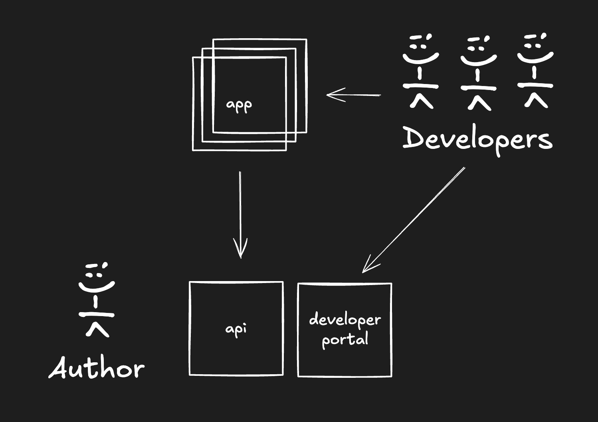

<!--
- Authors -> people building a developer portal
- Developers -> people using the API that the developer portal is about
-->

---

```yaml
layout: statement
```

# Some Characteristics


---

# Documentation Kinds

Authors should be able to express different _kinds_ of documentation.

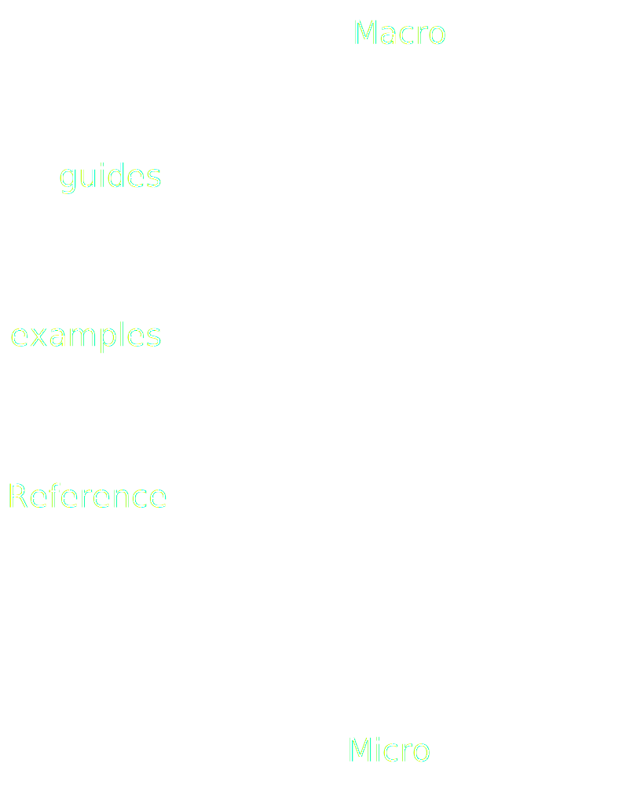

<!--

1. Guides:
   - Topic oriented (getting started, authorization, etc.)
   - Coarse grained
   - Typically manually written
   - ultimately free form
2. Examples:
   - Task oriented (how to do X with Y)
   - Medium grained (practical, link between guides and reference)
   - Typically manually written
3. Reference:
   - Interface oriented (inputs, outputs, etc.)
   - Fine grained
   - Typically generated in part or whole from a schema

-->

---

# Related Content

Authors should be able to easily manage connections between content kinds.

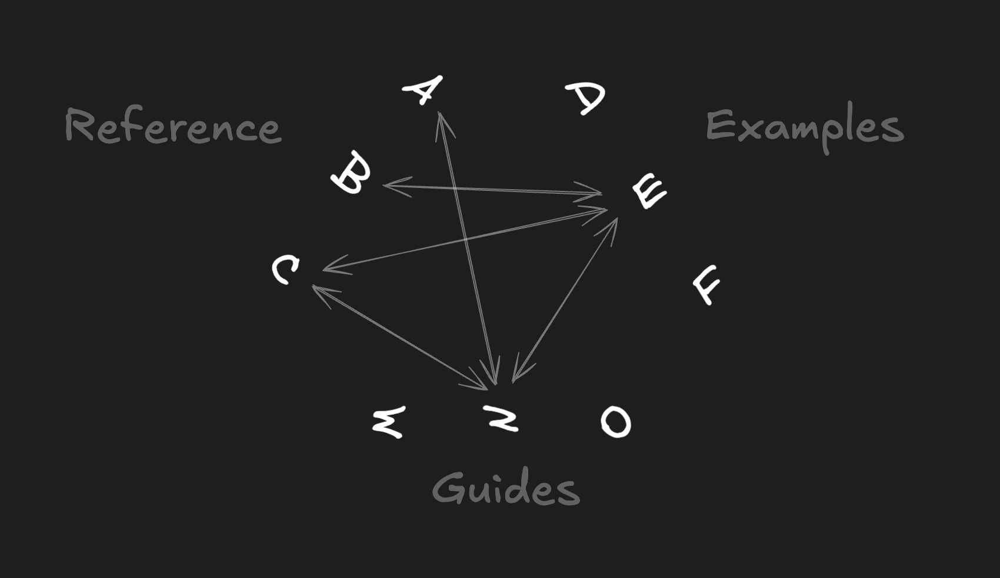

<!--
- Reference-to-Guide: Reference docs for GraphQL fields sensitive to authorization include connections to a guide about authorization
- Guide-to-Example: An authorization guide includes connections to examples that implicate authorization
- etc.
-->

---

# Views

Authors should be able to show the schema in different ways that optimize for different tasks.

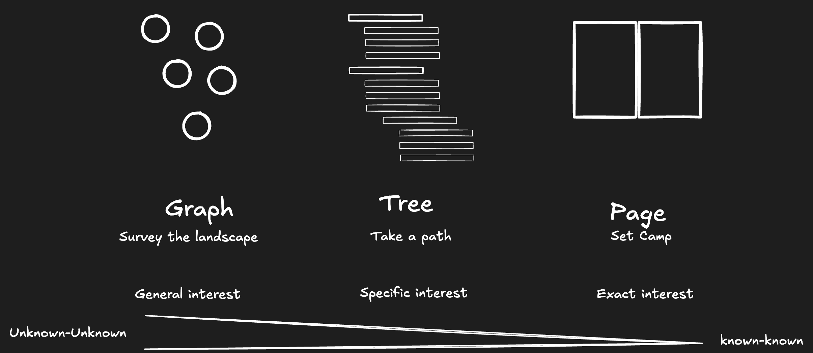

<!--
1. Graph
   - Feeling: Workbench, Macro, top of the mountain, surveying the landscape
   - Good for: Exploration, building schema-level mental model, discover relationships, themes, understand dense and sparse spots
2. Tree
   - Feeling: Workbench, Micro, Starting from a trailhead, walking along paths
   - Good for: Drilling, building type-level mental model
3. Page
   - Feeling: familiar, focused, stable
   - Good for: addressability, sharing, saving
-->

---

# Augmentations

Authors should be empowered to add/change descriptions on schema elements.

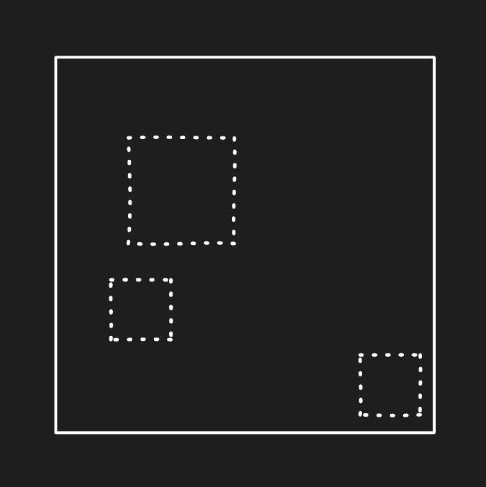

<!--
Motivations may include:

- arbitrary experimentation
- temporary hot fixes
- localization
- A/B testing
- interactive features
-->

---

# API Versions & Revisions

Authors should be able to communicate different **VERSIONS** and **REVISIONS**

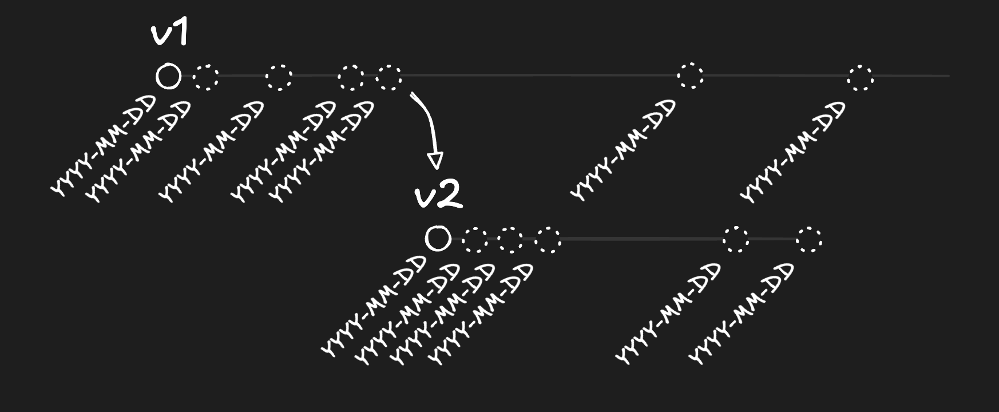

<!--

- Definitions:
- version -> an addressable endpoint
- revision -> a mutation to the API, cannot address previous point

- Meet the complexity of the real world
- Even if GraphQL reduces the need for API versioning, authors should not be cornered in on this topic.
- Organize information to keep developers confident and informed

-->

---

# Play

Developers should be able to instantly try out operations against the API.


<!--
Take GraphiQL further foundation for playground experiences. Building on top of that, developers should be able to:

- Have automated tokens based on login and project/environment context
- Save and organize documents, share with team
- Navigate to reference like with guide GQL document blocks or open inline
-->

---

# Context

A developer should be able to filter, highlight, save, etc. content that is relevant to their projects.

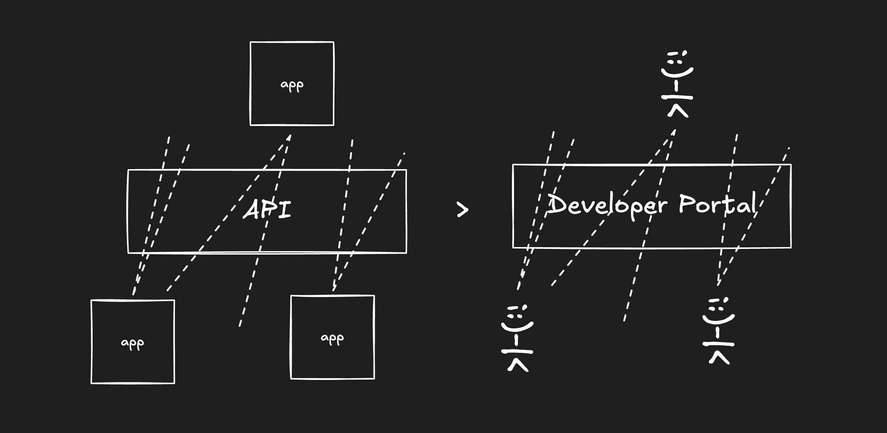

<!--
It is common for APIs to have large surface areas used in different ways by developers.

A developer should be able to:
- sign into the docs ...
- select among their projects/environments ...
- experience tailored docs

E.g. reference:

- Pre-selected API version based on what app uses
- Focus reference to types, fields, etc. used in actual requests
- See request metrics next to types, fields etc.
  In playground:
  - Automated token management
  - Save documents for later use and reference
    In examples:
  - Lead with client kind that is actually in use by the project
    In general:
- Pin content for fast access: reference paths, examples, saved playground documents, etc.
-->

---

# Collaboration

Developers should be able to build context _as a team_

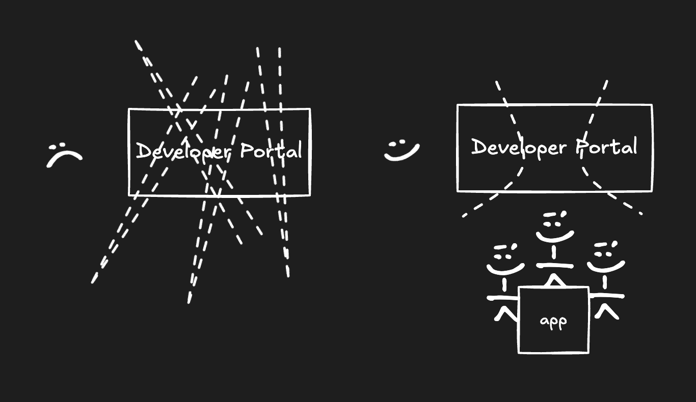

---

# Abstraction Levels

Authors should be able to adopt a tool at their desired abstraction level

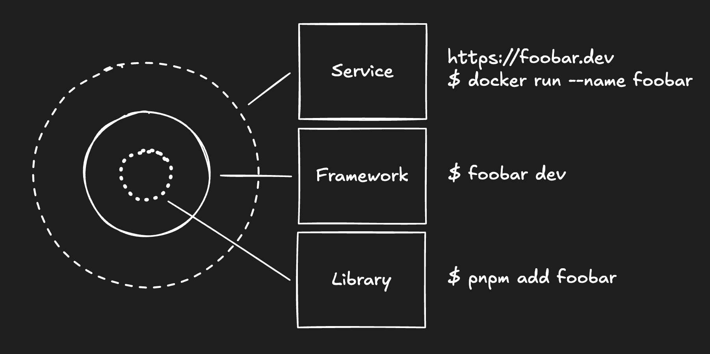

<!--
DIY to Turn Key, each layer building upon the former.

1. Libraries
   - Building blocks
   - Use cases: Brown field, incremental adoption, tangental goals
   - Benefits: Control, flexibility, radical customization
   - Blocks: Provided
   - Approach: Owned
   - Deployment: Owned
2. Framework
   - Opinionated library composition
   - Use cases: Green field, prototypes, MVPs, content focused teams
   - Benefit: Rapid development (use a cow path), easy upgrades (declarative means intent is decoupled from implementation)
   - Audience: Content focused teams
   - Blocks: Provided
   - Approach: Provided
   - Deployment: Author
3. SaaS
   - Turn key hosted solution
   - Use cases: Framework + zero ops
   - Benefit: Zero ops, focus on content, ultra rapid development, preview deployments, GitHub integration, etc.
   - Blocks: Provided
   - Approach: Provided
   - Deployment: Provided
-->

---

# Architecture Kinds

Authors should be able to choose the architecture that best fits their needs

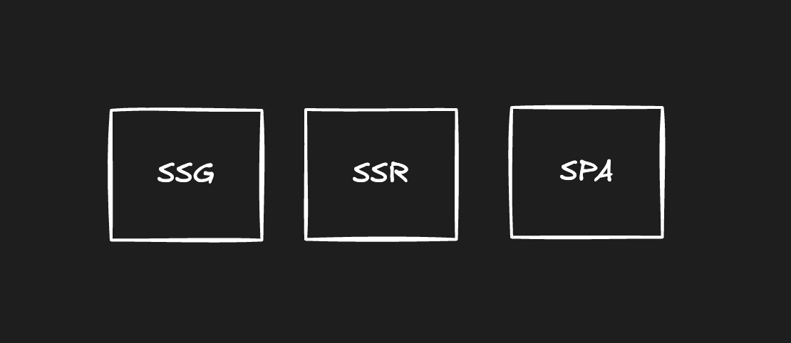

<!--

If they are using developer context features a portable server should easily available, but if they aren't using such features, they should be able to shed the server.

1. SSG
   - Static HTML pages
   - Deployment: static
   - Benefits: SEO, serverless
   - Use cases: Public documentation
2. SPA
   - Client Application
   - Deployment: static
   - Benefits: serverless, fast simple builds
   - Use cases: Prototypes, internal docuentation
3. SSR
   - Server+Client Application
   - Benefits: SEO, Developer context and collaboration features
-->

---

# AI

...

---

```yaml
layout: statement
```

# Prototype

<!--
https://polen.js.org

https://github.com/the-guild-org/polen
-->


<!--
- We have been experimenting in the open with some of these ideas in a prototype JS framework called Polen.

- You can already check it out at https://polen.js.org where you can see docs and demos.
-->

---

# Demo Time

---

# Tech Stack

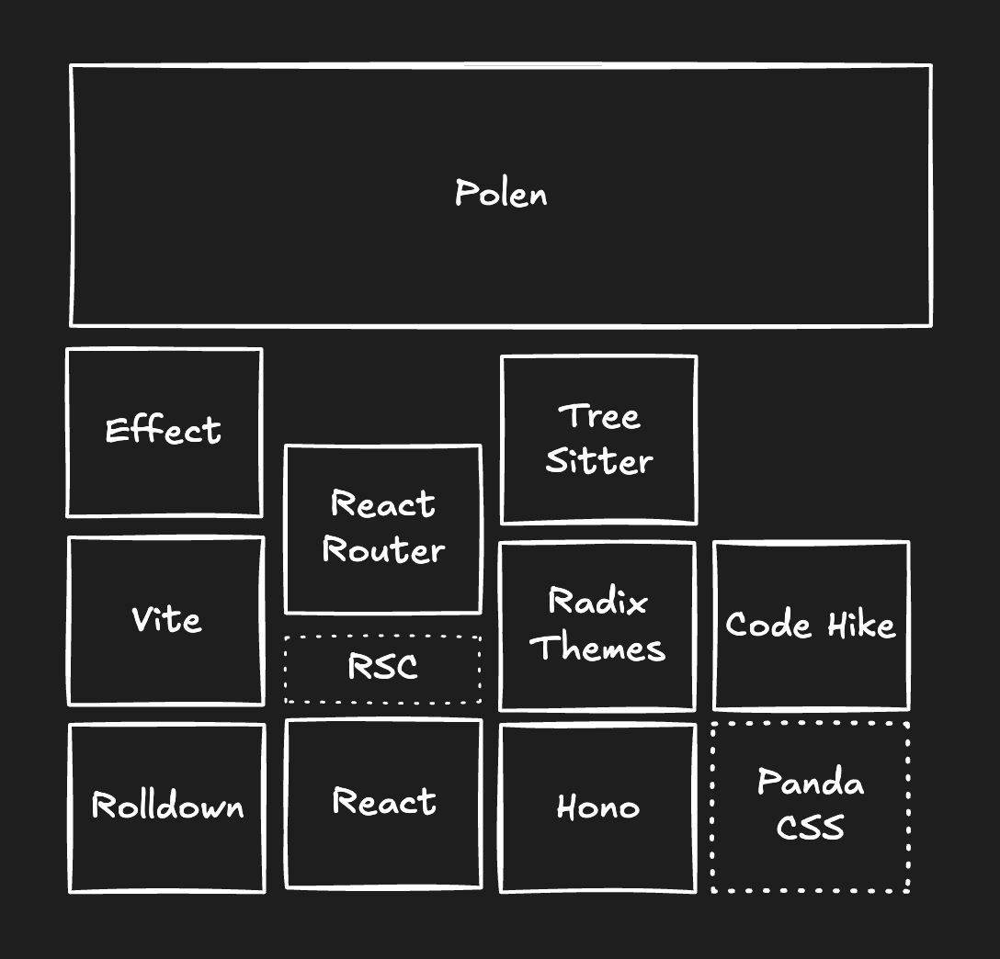

---

```yaml
layout: two-cols-header
```

# What’s next?

::left::

**Nearer Term**

- Refine + finish existing features
- Improve design
- Stablize
- Get feedback! Please reach out over GitHub issues, Discussions, PRs, etc.

::right::

**Longer Term**

- Performance improvements
- User Context
- GraphQL Hive adaptor
- AI Q&A, search, MCP generation, ...
- ...

---

```yaml
layout: statement
```

# Thanks!


BlueSky: @kuhrt.me

GitHub: @jasonkuhrt
